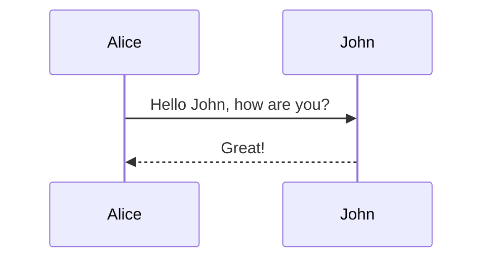
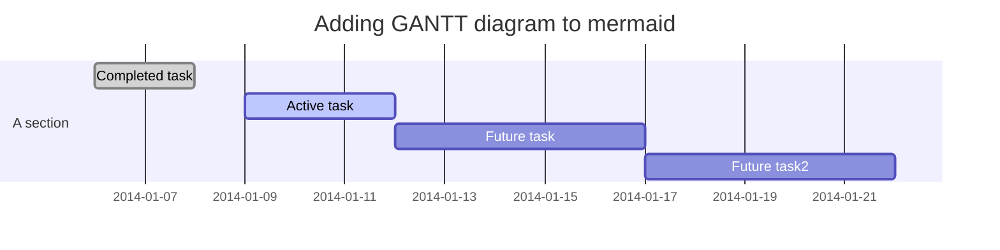

# [flowchart](https://flowchart.vuepress.ulivz.com/)

* wapper of [flowchart.js](https://github.com/adrai/flowchart.js)

    ```
    @flowstart
    cond=>condition: Process?
    process=>operation: Process
    e=>end: End

    cond(yes)->process->e
    cond(no)->e
    @flowend
    ```

@flowstart
cond=>condition: Process?
process=>operation: Process
e=>end: End

cond(yes)->process->e
cond(no)->e
@flowend

# [Mermaid UML](https://github.com/knsv/mermaid)

[UML document](https://mermaidjs.github.io/)

## Flowchart

    ```mermaid
    graph TD;
        A-->B;
        A-->C;
        B-->D;
        C-->D;
    ```


## Sequence diagram

    ```mermaid
    sequenceDiagram
        Alice->>John: Hello John, how are you?
        John-->>Alice: Great!
    ```



## Gantt diagram

    ```mermaid
    gantt
    dateFormat  YYYY-MM-DD
    title Adding GANTT diagram to mermaid
    section A section
    Completed task            :done,    des1, 2014-01-06,2014-01-08
    Active task               :active,  des2, 2014-01-09, 3d
    Future task               :         des3, after des2, 5d
    Future task2               :         des4, after des3, 5d
    ```




# [PlantUML](http://plantuml.com/zh/index)

    @startuml
    Bob -> Alice : hello
    @enduml
 
@startuml
Bob -> Alice : hello
@enduml


    @startuml
    
    [*] --> State1
    State1 --> [*]
    State1 : this is a string
    State1 : this is another string
    
    State1 -> State2
    State2 --> [*]
    
    @enduml

@startuml

[*] --> State1
State1 --> [*]
State1 : this is a string
State1 : this is another string

State1 -> State2
State2 --> [*]

@enduml

